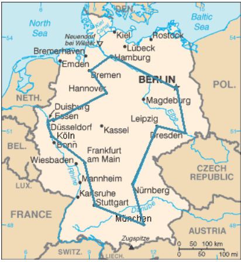
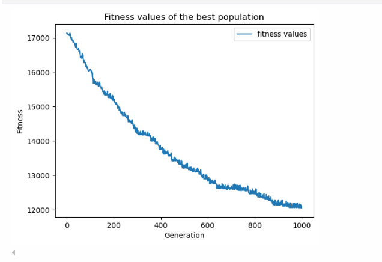
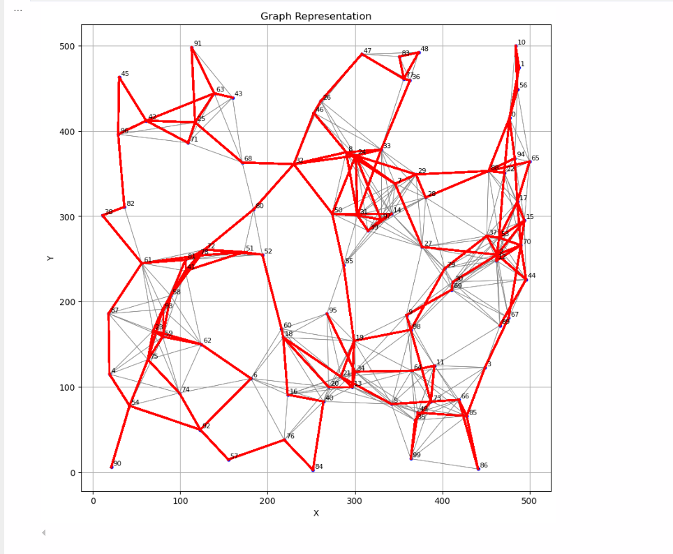

# Heuristic and Meta-Heuristic Search to Solve Cycle Finding Problem

A comprehensive research implementation comparing local search (Hill Climbing) and meta-heuristic (Genetic Algorithm) approaches for solving a constrained variant of the Traveling Salesman Problem.

**Author:** Khennaoui Mohamed Seif  
**Institution:** University of Abdelhamid Mehri, Constantine 2, Algeria  
**Program:** Foundation/Master1 SDIA  
**Date:** November 9, 2025

---

## Table of Contents

1. [Introduction](#introduction)
2. [Problem Definition](#problem-definition)
3. [Methodology](#methodology)
4. [Algorithms Implementation](#algorithms-implementation)
5. [Experimental Results](#experimental-results)
6. [Installation and Usage](#installation-and-usage)
7. [Project Structure](#project-structure)
8. [Future Work](#future-work)
9. [Citation](#citation)
10. [License](#license)

---

## Introduction

In artificial intelligence and computer science, the complexity of computation and the quality of algorithms are fundamental evaluation criteria. For NP-hard problems such as the Traveling Salesman Problem (TSP), obtaining exact solutions within polynomial time is often impractical. This research explores heuristic methods to obtain approximate solutions with reasonable computational complexity.



This project investigates two distinct approaches:
- **Local Search Method:** Hill Climbing Algorithm
- **Global Stochastic Method:** Genetic Algorithm

The goal is to compare their effectiveness in solving a constrained TSP variant where not all cities are directly connected.

---

## Problem Definition

### The Traveling Salesman Problem (TSP)

The classical TSP asks: *"Given a list of cities and the distances between each pair of cities, what is the shortest route that visits each city exactly once and returns to the original city?"*

### Constrained Variant

This research addresses a modified TSP with the following specifications:

- **Number of Cities:** 100
- **Bounded Space:** 500 × 500 km
- **Distance Constraint:** Two cities are connected only if their distance is less than 90 km
- **Objective:** Find a Hamiltonian cycle that minimizes total distance

### Mathematical Formulation

The Euclidean distance between cities *i* and *j* is calculated as:

```
d(i,j) = √[(x_i - x_j)² + (y_i - y_j)²]
```

**Constraint:** An edge between cities *i* and *j* exists if and only if *d(i,j) < 90 km*

**Objective Function:** Minimize the total cycle distance:
```
Total Distance = Σ d(city_i, city_{i+1})
```


The graph representation shows cities as nodes with edges only between cities within the 90 km distance constraint, creating a sparse graph structure while maintaining NP-hard complexity.

---

## Methodology

### Graph Representation

The problem space is represented by a function that:
1. Takes city coordinates as input (randomly generated or file-based)
2. Calculates pairwise Euclidean distances
3. Creates edges only between cities with distance < 90 km
4. Outputs a constrained graph structure


A state in this problem is defined as a cycle of 100 unique nodes (cities), ensuring all cities are visited exactly once.

---

## Algorithms Implementation

### 1. Hill Climbing Algorithm

Hill Climbing is a local search method that:
- Begins with a randomly generated initial solution
- Explores the neighborhood of the current solution
- Moves to improved solutions when found
- Terminates at a local optimum

#### Algorithm Pseudocode

```
Algorithm: Simple Local Search
Require: Initial solution s, heuristic function f(s), Neighborhood function N(s)
Ensure: Best solution s*

1: Initialize s* ← s
2: repeat
3:     Select s' ∈ N(s)
4:     if f(s') > f(s*) then
5:         s* ← s'
6:     end if
7:     Update s ← s'
8: until Stopping criterion is met
9: return s*
```

#### Evaluation Function

The evaluation function calculates the total cycle distance by summing Euclidean distances between consecutive cities:

```python
def evaluate(solution):
    distance = 0
    for i in range(len(solution) - 1):
        distance += euclidean_distance(solution[i], solution[i+1])
    return distance
```

#### Neighborhood Generation

Transitions between solutions are made by replacing a node in the current cycle with another, ensuring valid connections:

```
S(1 4 [8] 2 5 3 6 7 1) ⟹ (1 4 [3] 2 5 3 6 7 1)
where nodes 3 and 8 have the same neighbors
```

### 2. Genetic Algorithm

Genetic Algorithms (GAs) are derivative-free, stochastic optimization techniques inspired by biological evolution, based on the principle of "survival of the fittest."

#### Algorithm Pseudocode

```
Algorithm: Genetic Algorithm
Step 1: Create an initial population of P chromosomes
Step 2: Evaluate the fitness of each chromosome
Step 3: Choose P/2 parents via proportional selection
Step 4: Randomly select two parents and create offspring using crossover
Step 5: Apply mutation operators for minor changes
Step 6: Repeat Steps 4 and 5 until all parents are mated
Step 7: Replace the old population with the new one
Step 8: Evaluate fitness of the new population
Step 9: Terminate if maximum generations reached; otherwise, go to Step 3
```

#### Representation

Path representation is used for cycles. For example:
```
Tour: 1 → 4 → 8 → 2 → 5 → 3 → 6 → 7 → 1
Representation: (1, 4, 8, 2, 5, 3, 6, 7, 1)
```


#### Fitness Function

The fitness function evaluates solution quality with penalization for constraint violations:

```
Fitness = Total Distance + Penalty for Missing Nodes
```

The penalty mechanism ensures valid solutions (visiting all cities) are prioritized during selection.

#### Crossover Operators

Dynamic crossover points are chosen randomly to ensure valid cycles:

```
Parent 1: (1, 2 | 4, 5, 6 | 7, 2, 1)
Parent 2: (3, 6, 4, 5, 6, 7, 2 | 1, 3, 4, 6 | 7, 9, 7)

Offspring 1: (1, 2 | 1, 3, 4, 6 | 7, 2, 1)
Offspring 2: (3, 6, 4, 5, 6 | 4, 5, 6 | 7, 9, 7)
```

#### Mutation Function

Mutation follows a similar principle to Hill Climbing's neighborhood exploration:

```
S(1 4 [8] 2 5 3 6 7 1) → (1 4 [3] 2 5 3 6 7 1)
where nodes 3 and 8 have the same neighbors
```

#### Parameters

- **Population Size:** 50
- **Maximum Generations:** 300
- **Mutation Rate:** 0.2 (20%)
- **Crossover Rate:** Adaptive
- **Selection Method:** Proportional (Roulette Wheel)

---

## Experimental Results

### Hill Climbing Results

**Configuration:**
- Maximum Iterations: 1000
- Initial Solution: Randomly generated cycle

**Performance:**
- Best Solution: 7,289 km
- Current Solution: 11,681 km
- Execution Time: 688.23 ms




The evolution plot shows rapid initial improvement followed by convergence to a local optimum around iteration 200.



### Genetic Algorithm Results

**Configuration:**
- Population Size: 50
- Maximum Generations: 300
- Mutation Rate: 0.2

**Performance:**
- Best Solution: 5,208 km
- Current Solution: 5,954 km
- Execution Time: 38,141.99 ms


The GA demonstrates steady improvement throughout execution, successfully converging to a solution of 5,954 km with the best observed solution at 5,208 km.

### Comparative Analysis

| Metric | Hill Climbing | Genetic Algorithm | GA Improvement |
|--------|--------------|-------------------|----------------|
| Execution Time (ms) | 688.23 | 38,141.99 | -98.2% (slower) |
| Current Solution (km) | 11,681 | 5,954 | +49.0% (better) |
| Best Solution (km) | 7,289 | 5,208 | +28.5% (better) |

#### Key Observations

**Local Search Methods (Hill Climbing):**
- Significantly faster in execution (55× faster)
- Lower spatial and temporal complexity
- Highly sensitive to initial solution quality
- Prone to becoming trapped in local optima
- Suitable for quick approximate solutions

**Global Search Methods (Genetic Algorithm):**
- Less sensitive to initial solution
- Superior exploration of solution space
- Consistently finds better quality solutions
- Higher computational cost and resource consumption
- Ability to escape local optima through population diversity

### Hybrid Approach Potential

The report identifies several hybrid implementation strategies:

1. **Initial Population Seeding:** Use Hill Climbing to generate locally optimized initial populations for GA
2. **Offspring Refinement:** Apply Hill Climbing to GA-generated solutions after crossover/mutation
3. **Parent Optimization:** Refine selected parents before crossover operations

**Trade-off:** While hybrid approaches can generate superior solutions, time complexity grows exponentially, particularly when optimizing every parent or multiple solutions per generation.

---

## Installation and Usage

### Prerequisites

```bash
Python >= 3.8
numpy >= 1.21.0
matplotlib >= 3.4.0
scipy >= 1.7.0
pandas >= 1.3.0
```

### Installation

```bash
git clone https://github.com/yourusername/constrained-tsp-heuristics.git
cd constrained-tsp-heuristics
pip install -r requirements.txt
```

### Usage Examples

#### Hill Climbing

```python
from src.hill_climbing import HillClimbing
from src.utils import generate_cities, create_graph

# Generate problem instance
cities = generate_cities(n_cities=100, space_size=500)
graph = create_graph(cities, max_distance=90)

# Run Hill Climbing
hc = HillClimbing(graph, max_iterations=1000)
solution, cost = hc.run()

print(f"Best solution cost: {cost} km")
```

#### Genetic Algorithm

```python
from src.genetic_algorithm import GeneticAlgorithm
from src.utils import generate_cities, create_graph

# Generate problem instance
cities = generate_cities(n_cities=100, space_size=500)
graph = create_graph(cities, max_distance=90)

# Run Genetic Algorithm
ga = GeneticAlgorithm(
    graph,
    population_size=50,
    max_generations=300,
    mutation_rate=0.2
)
solution, cost = ga.run()

print(f"Best solution cost: {cost} km")
```

#### Loading Custom Data

```python
from src.utils import load_cities

cities = load_cities('data/cities_100.txt')
# Format: each line contains "x_coordinate y_coordinate"
```

---

## Project Structure

```
constrained-tsp-heuristics/
├── src/
│   ├── __init__.py
│   ├── hill_climbing.py          # Hill Climbing implementation
│   ├── genetic_algorithm.py      # Genetic Algorithm implementation
│   ├── utils.py                   # Utility functions
│   ├── evaluation.py              # Fitness/evaluation functions
│   └── visualization.py           # Plotting and visualization
├── data/
│   ├── cities_100.txt             # Sample city coordinates
│   └── test_instances/            # Additional test cases
├── results/
│   ├── figures/                   # Generated plots and visualizations
│   │   ├── tsp.PNG
│   │   ├── graph representation.PNG
│   │   ├── random generated cycle.PNG
│   │   ├── train_hill_climbing.PNG
│   │   ├── train_evolution_hill.PNG
│   │   ├── best_solution_hill.PNG
│   │   ├── genetic represantation.PNG
│   │   ├── train_best_solution genetic.PNG
│   │   └── population fit gen.PNG
│   └── tables/                    # Numerical results
├── experiments/
│   ├── run_hill_climbing.py
│   ├── run_genetic_algorithm.py
│   └── comparative_analysis.py
├── tests/
│   ├── test_hill_climbing.py
│   ├── test_genetic_algorithm.py
│   └── test_utils.py
├── docs/
│   ├── report.pdf                 # Full research report
│   └── methodology.md
├── requirements.txt
├── README.md
└── LICENSE
```

---

## Future Work

1. **Scalability Analysis:** Extension to larger problem instances (200+, 500+, 1000+ cities)
2. **Multi-Objective Optimization:** Incorporating additional objectives (time windows, vehicle capacity)
3. **Parallel Implementation:** Distributed genetic algorithm with island models
4. **Real-World Applications:** Application to vehicle routing and logistics problems
5. **Comparative Analysis:** Benchmarking against other metaheuristics (Simulated Annealing, Ant Colony Optimization, Particle Swarm Optimization)
6. **Adaptive Parameters:** Dynamic adjustment of mutation rates and population size
7. **Deep Learning Integration:** Using metaheuristics for neural network hyperparameter optimization

---

## Conclusion

This research demonstrates that while local search methods like Hill Climbing are computationally efficient, they are constrained by sensitivity to initial conditions and susceptibility to local optima. In contrast, global methods such as Genetic Algorithms offer superior robustness and solution quality through diverse population exploration, albeit at higher computational cost.

The choice between algorithms depends on specific problem requirements:
- **Hill Climbing:** Suitable when rapid approximate solutions are acceptable
- **Genetic Algorithm:** Preferred when solution quality is paramount and computational resources are available
- **Hybrid Approaches:** Optimal for balancing quality and efficiency, though requiring careful complexity management

Furthermore, metaheuristic methods demonstrate promising potential for optimization of complex, high-dimensional problems including deep learning model training, hyperparameter tuning, and non-convex optimization landscapes.

---

## Citation

If you use this code or methodology in your research, please cite:

```bibtex
@techreport{khennaoui2025heuristic,
  title={Heuristic and Meta-Heuristic Search to Solve Cycle Finding Problem},
  author={Khennaoui, Mohamed Seif},
  institution={University of Abdelhamid Mehri, Constantine 2},
  year={2025},
  month={November},
  address={Constantine, Algeria}
}
```

---

## License

This project is licensed under the MIT License - see the [LICENSE](LICENSE) file for details.

---

## Contact

**Mohamed Seif Khennaoui**  
Foundation/Master1 SDIA Program  
University of Abdelhamid Mehri, Constantine 2  
Constantine, Algeria  

**Email:** mohamed.khennaoui@univ-constantine2.dz

---

## Acknowledgments

This research was conducted as part of the coursework in the Foundation/Master1 SDIA program at the University of Abdelhamid Mehri, Constantine 2, Algeria. Special thanks to the faculty advisors and colleagues who provided valuable feedback throughout this research.

---

## Note on Code Availability

The complete source code implementation is available in this repository. The code has been developed following best practices in software engineering and is provided for educational and research purposes. Contributions and improvements are welcome through pull requests.

---

**Last Updated:** November 9, 2025
